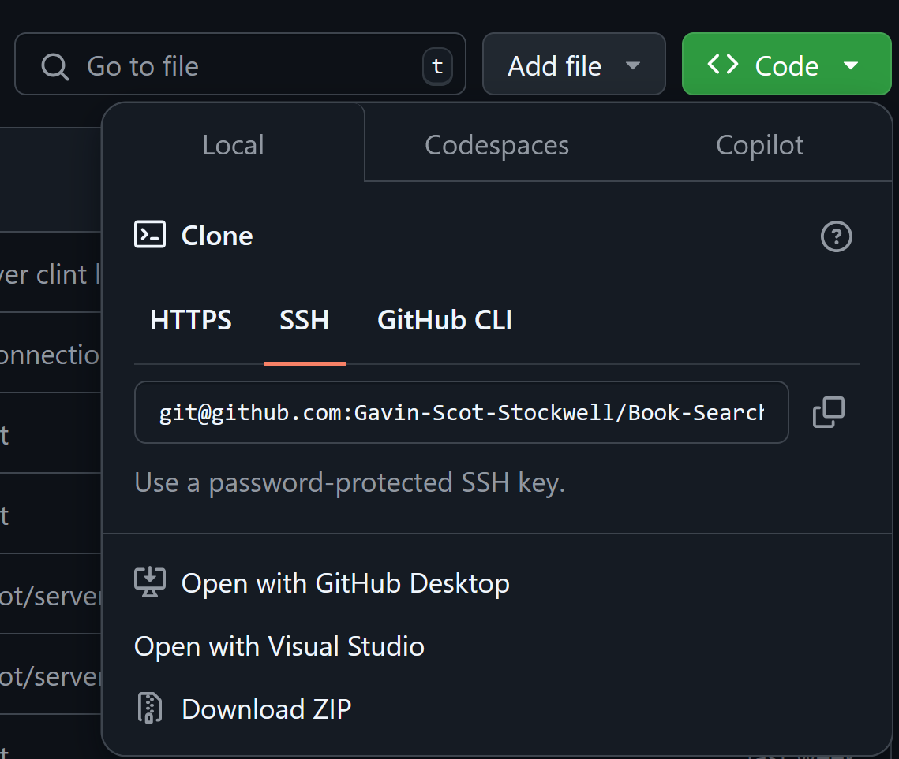

# Book Search Engine

## License

# Table Of Contents
* [Description](#description)
* [Installation](#installation)
* [Usage](#usage)
* [License](#license)
* [Contributing](#contributing)
* [Tests](#tests)
* [Questions](#questions)

## Description
Trying to show the login and search for a book search engine.

## Installation
How to download
* Go to get hub page https://github.com/Gavin-Scot-Stockwell/Book-Search-Engine
* either download via the zip file or do a pull form github
 

## Usage
* Use the search feature to look for books
* Warning! The login is broken

## Contributing
* Gavin Stockwell -ts, mongoDB, mongoose, express, graphql, apollo

## Tests
* Before testing make user to npm i, run seed and npm start
* You must have insomnia to work with this
* You can look up books

## Questions
* GitHub-username https://github.com/Gavin-Scot-Stockwell
* Email-address gsstockwell@gmail.com

